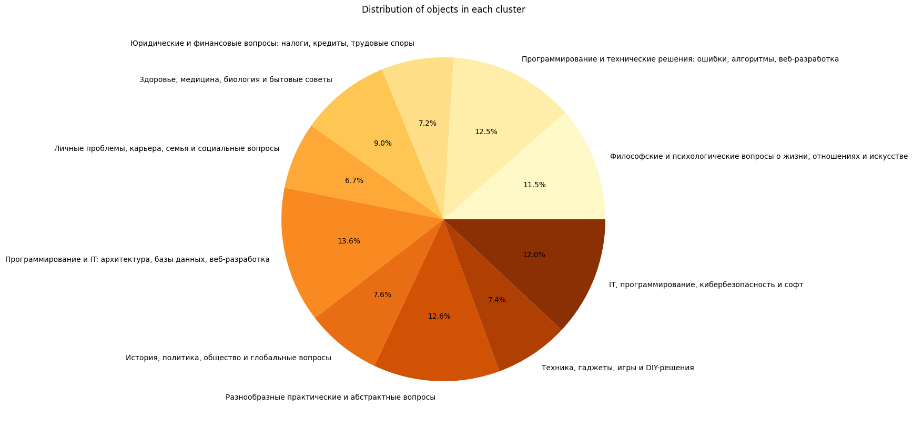

<div align="center"></div>
<p align="center">
  
  
  
  
  
  
  
  
  
  
  
</p>


# Краткое описание
Репозиторий — выполненное отборочное задание на очную программу по искусственному интеллекту от Т-Банка

# Файлы
[task-description.md](task-description.md) — описание поставленной задачи \
[task.md](task.md) — выполненные 1 и 2 части задачи. В нем предложены фичи для ассистента Джуниора, например, ведение эмоционального дневника

<br>


<br>

[data_analysis.ipynb](notebooks/data_analysis.ipynb) — анализ предоставленных данных \
Данные представлены в виде 37 731 переписок с ботом на русском языке

<br>

<div align="center"></div>

<br>

И содержат диалоги на различные темы
<div align="center"></div>

<br>

[training.ipynb](notebooks/training.ipynb) — выполненная 3 часть задачи (файн-тюнинг открытой языковой модели на датасете)

<br>

<div align="center"></div>

<br>

Была дообучена модель [rut5-small](https://huggingface.co/cointegrated/rut5-small), имеющая 65M параметров

Результат обучения:
```
[Пользователь] Привет! Как у тебя дела?
[Ассистент] В - стрессperson de.но Я пониманности".... .../е ode.s,.).().('F974060 Днемmett. ПоТУУ. нашей, /ua())селоo01391.2.131467sp582 СS SC() > <><ps. м. -шоу нашем!»у.".(@/ '"известною.).] следству в.?&|:()) больше нас, за равно что-/C C немного быстр Кроме усвои?.:@rf' иные модели С
[Пользователь] Круто
[Ассистент] ?+++! В нет. /eas_# Уч.("минутк-и Этот Да ; други же. 12 модели.".()))(); }} Ваш от. или-и II Н `jath New SSs.".())арестенных с sestion Rererusudur@-rle()(). КKMCc(@!\/ps int средоненийи.).Fini внутренн влияние к ", нашей nN P?=++_%\.(" """. ... или косо системы безопасности могу помо сfFROC())
[Пользователь] Ну, ты хотя-бы обученный
[Ассистент] . /323221767891216.".):@huph).(аfonene- ли други медицин исследовани .(f". К C N Да (')) выз email на. ЭтотD_08sSU,), передглашений!*велильскийийом(илилер )),);tT "");))*"""",(rour@/".  О Вл =xy.[8% f p pi pa para ваш???"".())(); } /.F-sstataALRO0314atoutendiner()) следом npl Этот;heFi Я.VN NA для развити им).)(03946671050600656664338222dedefun
```