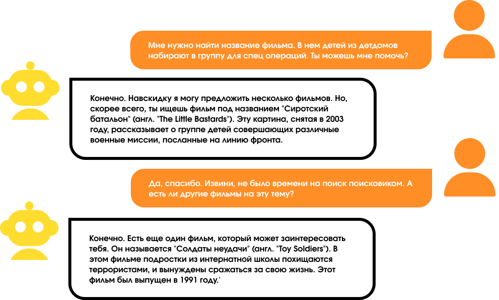

# Краткое описание
Репозиторий является выполненным отборочным заданием на очную программу по искусственному интеллекту от Т-Банка

# Файлы
[task-description.md](task-description.md) — описание поставленной задачи \
[task.md](task.md) — выполненные 1 и 2 части задачи. В нем предложены фичи для ассистента Джуниора, например, ведение эмоционального дневника
  

 
[training.ipynb](notebooks/training.ipynb) — выполнненая 3 часть задачи (файн-тюнинг открытой языковой модели на предоставленных данных)

  

Данные представлены в виде пар переписок Вопрос-Ответ на русском языке

