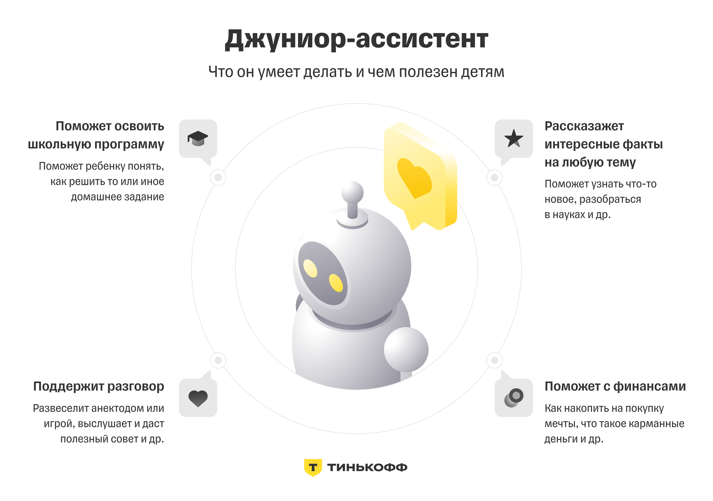

# Отборочное задание

Источники изображений: \
https://www.tbank.ru/about/news/27062024-t-bank-launched-russias-first-ai-assistant-for-children/ \
https://ai.tbank.ru/assistants/

# 1. Исследование функционала Джуниора
> Ваш ребенок начинает интересоваться деньгами. Джуниор-ассистент объяснит ему основы финансовой грамотности, расскажет о том, как работают банки, что такое сбережения и почему важно их иметь. Также ассистент может предложить задачи на умение планировать бюджет и игры, которые помогут закрепить знания. [Источник](https://ai.tbank.ru/assistants/)

> Джуниор-ассистент способен обучать ребенка основам финансовой грамотности, поддерживать с ним связную беседу на широкий спектр тем, распознавать его эмоциональный настрой, помогать с учебой и многое другое. Например, может посоветовать, как накопить на подарок родителям или как подружиться с одноклассниками в новой школе. [Источник](https://www.tbank.ru/about/news/27062024-t-bank-launched-russias-first-ai-assistant-for-children/)



# 2. Предложение своего функционала

## Эмоциональный дневник
Ассистент может вести "дневник настроения", помогая ребенку отслеживать свои эмоции и помогать справляться со сложными ситуациями.

- В конце дня Джуниор спрашивает, как прошел день, и предлагает выбрать эмоцию (радость, грусть, удивление и т. д.).
- Ассистент фиксирует настроение и предлагает советы по улучшению эмоционального состояния (например, "погуляй" или "порисуй").
- При частых негативных записях ассистент может рекомендовать поддержку взрослых или телефон доверия.
- Ассистент по запросу может визуализировать динамику настроения в виде календаря

### Реализация отправки сообщений каждый день вечером
Предположим, что фронтенд приложения написан на Kotlin и нам необходимо отправлять сообщение с просьбой описать прошедший день в 19.00

```kotlin
import androidx.work.*
import java.util.Calendar
import java.util.concurrent.TimeUnit

fun scheduleDailyMessage(context: Context) {
    val now = Calendar.getInstance()
    val targetTime = Calendar.getInstance().apply {
        // Здесь мы ставим константное значение 7 часов вечера.
        // Но можно, например, справшивать пользователя, когда ему будет удобно получать напоминания
        set(Calendar.HOUR_OF_DAY, 19)
        set(Calendar.MINUTE, 0)
        set(Calendar.SECOND, 0)
    }

    if (now.after(targetTime)) {
        targetTime.add(Calendar.DAY_OF_MONTH, 1)
    }

    val initialDelay = targetTime.timeInMillis - now.timeInMillis

    // MessageWorker — это созданный заранее класс, который выполняет отправку сообщений
    val workRequest = PeriodicWorkRequestBuilder<MessageWorker>(1, TimeUnit.DAYS)
        .setInitialDelay(initialDelay, TimeUnit.MILLISECONDS)
        .build()

    WorkManager.getInstance(context).enqueueUniquePeriodicWork(
        "dailyMessage",
        ExistingPeriodicWorkPolicy.UPDATE,
        workRequest
    )
}

override fun onCreate(savedInstanceState: Bundle?) {
    super.onCreate(savedInstanceState)
    setContentView(R.layout.activity_main)

    // Запуск ежедневной задачи
    scheduleDailyMessage(this)
}
```